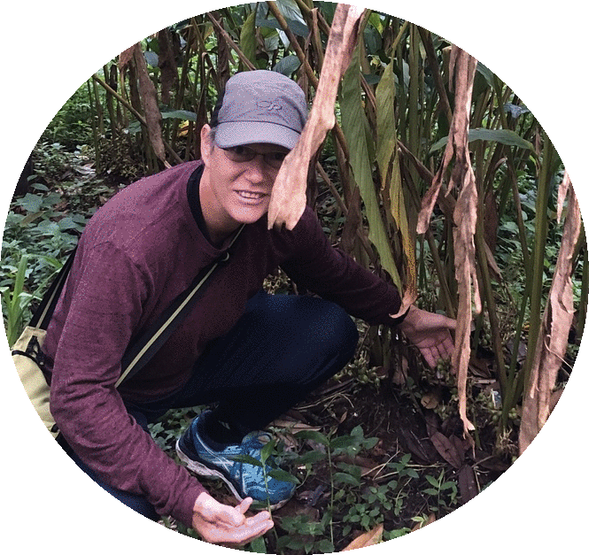

# [E. Eli Holmes](https://eeholmes.github.io/)  

  

Research Fisheries Biologist, Northwest Fisheries Science Center, NOAA Fisheries 
Affiliate faculty, SAFS, University of Washington, Seattle

***

My personal profile has mostly random or sandboxy repositories. To find my actual code products, look in the GH organizations that I contribute to.

| Time series  | Math Bio | Fish Forecast | R Workflow | Remote Sensing Tools | Upwelling |
| :---: | :---: | :---: | :---: | :---: | :---: |
|  |  |  |  |  |  |
  
